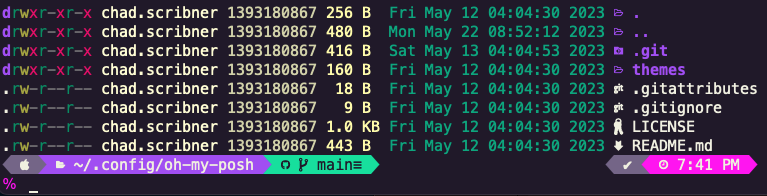

# README-prompt-mac

Instructions on how to make your Mac OS prompts to look like the screenshot.



## Homebrew

Install via default shell

```sh
/bin/bash -c "$(curl -fsSL https://raw.githubusercontent.com/Homebrew/install/HEAD/install.sh)"
brew tap homebrew/cask-versions
```

## Lsd

Install

```sh
brew install lsd || brew upgrade lsd
```

## Zsh

Install

```sh
brew install zsh || brew upgrade zsh

git clone https://github.com/cscribn/config-zsh.git  ~/.config/zsh

cp ~/.config/zsh/zshrc-mac ~/.zshrc
```

Note: Perform remaining steps using Zsh unless otherwise stated.

## Git

Install

```sh
brew install git || brew upgrade git
```

## Fonts

Install

```sh
brew install --cask font-meslo-lg-nerd-font || brew upgrade --cask font-meslo-lg-nerd-font
```

## Oh-My-Posh

Install

```sh
brew install brew install jandedobbeleer/oh-my-posh/oh-my-posh || brew upgrade brew install jandedobbeleer/oh-my-posh/oh-my-posh

git clone https://github.com/cscribn/config-oh-my-posh.git  ~/.config/oh-my-posh
```

## PowerShell Core

Install

```sh
brew install --cask powershell || brew upgrade --cask powershell
```

Install modules and profile via PowerShell

```pwsh
Install-Module posh-git -Force
Install-Module PSReadLine -AllowPrerelease -Force
Install-Module -Name Terminal-Icons -Repository PSGallery

curl -Lo "~/.config/powershell/Microsoft.PowerShell_profile.ps1" https://raw.githubusercontent.com/cscribn/config-misc/main/powershell-core/Microsoft.PowerShell_profile.ps1
```

## iTerm2

Install

```sh
brew install --cask iterm2 || brew upgrade --cask iterm2
```

## Vim

```sh
brew install vim || brew upgrade vim

curl -Lo "$HOME/.vimrc" https://raw.githubusercontent.com/cscribn/config-misc/main/vim/vimrc
```

## Visual Studio Code

Install

```sh
brew install --cask visual-studio-code || brew upgrade --cask visual-studio-code
```

Edit settings.json

```json
    "terminal.integrated.fontFamily": "MesloLGS Nerd Font Mono",
    "terminal.integrated.fontSize": 13,
```
